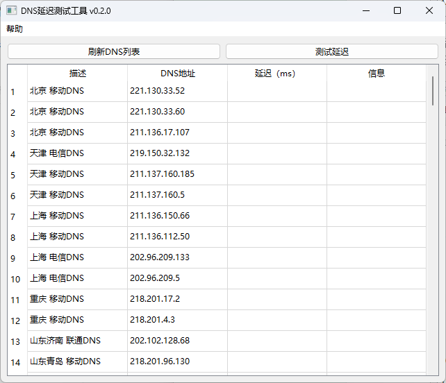

#### 《DNS测试工具》

一款DNS测试工具，可以测试多个DNS服务器的延迟，帮助快速选出当前位置最快的DNS服务器。

我个人收录了全国各地130+个DNS服务器，由于精力有限，无法确保每个DNS服务器均能正常上网。如若出现在测试中某DNS服务器延迟低但无法上网的情况，请自行更换DNS服务器。

#### 如何使用

打开软件后会自动从服务器获取DNS数据，获取完毕后点击【测试延迟】按钮，会并行测试DNS数据的延迟。

测试完毕之后点击【延迟（ms）】选项，可以对延迟进行排序，从而选出您当前位置的最低延迟DNS服务器。此时可用选择延迟最低的两个DNS地址进行设置。

