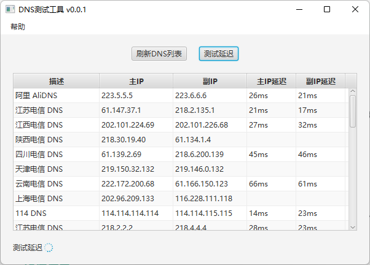
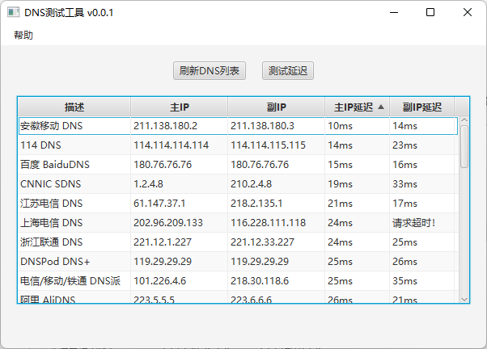

#### 《DNS测试工具》

一款DNS测试工具，可以测试多个DNS服务器的延迟，帮助快速选出当前位置最快的DNS服务器。

下载并解压 DnsTestTool.zip 压缩包，双击 bin 目录下的【DNS测试工具.exe】即可运行软件。

#### 如何使用

打开软件后会自动从服务器获取DNS数据，获取完毕后点击【测试延迟】按钮，会并行测试DNS数据的延迟

测试完毕之后点击【主IP延迟】选项，可以对延迟进行排序，从而选出您当前位置的最低延迟DNS服务器：

